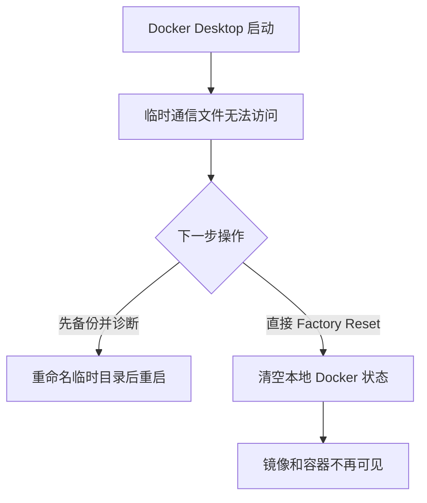

# 别急着点 Factory Reset：一次 Docker 镜像丢失复盘

> Docker Desktop 启动失败，不等于镜像已经损坏。真正需要警惕的，是在没有备份时执行 Factory Reset。

这次故障发生在一台 Windows 开发机上。Docker Desktop 启动时提示 `The file cannot be accessed by the system`。为了尽快恢复开发，我点击了弹窗里的 **Reset to factory defaults**。程序重新启动了，本地镜像、容器和原运行环境却随之消失。

本文只回答三个问题：哪里出了错，为什么 Reset 会扩大损失，以及遇到同类故障时应该怎样处理。

> **一句话结论：** 启动失败发生在 Docker 后台的临时通信文件；镜像丢失则由后续 Reset 和“只有本机一份”共同造成。


## 一、先分清：启动失败不等于镜像损坏

截图里的 `dockerInference`，以及另一轮报错中的 `sailor-ingest.sock`，都是 Docker Desktop 后台使用的临时通信文件，技术上称为 AF_UNIX socket，可以把它理解成后台组件之间的“临时插座”。

当时的日志表示：Docker 想移除旧 socket 并重新创建，但 Windows 无法访问这个对象，于是后台启动中止。报错没有指向业务镜像或 `Dockerfile`，因此不能由此判断镜像已经损坏。

两份 Windows 平台的公开报告复现了几乎相同的路径和错误：异常退出或待机后，旧 socket 无法正常删除；停止 Docker Desktop、重命名所在目录后，程序可以重新启动。[docker/desktop-feedback#531](https://github.com/docker/desktop-feedback/issues/531)、[docker/desktop-feedback#554](https://github.com/docker/desktop-feedback/issues/554)

结合本机日志，最可信的技术原因是：**临时 socket 残留或处于不可访问状态，阻塞了 Docker 后台启动。** 但本机没有记录故障前一刻究竟发生了休眠、强制结束还是进程崩溃，因此不能进一步断言具体触发事件。

整个过程可以简化为：



*图 2：启动失败没有删除镜像；后续 Factory Reset 才改变了本地数据状态。*

## 二、镜像丢失：Factory Reset 加本地单副本

`Reset to factory defaults` 不是重启，而是把 Docker Desktop 恢复到初始状态。Docker 官方也要求，在重置前先备份需要保留的镜像和数据。[Docker Desktop 故障排查](https://docs.docker.com/desktop/troubleshoot-and-support/troubleshoot/)、[备份与恢复](https://docs.docker.com/desktop/settings-and-maintenance/backup-and-restore/)

本次 Reset 后，本地镜像和容器不再可见。旧镜像又没有推送到仓库、导出为 TAR（镜像归档文件），也没有数据盘副本，所以无法原样恢复。

登录 Docker Hub 不等于自动云备份。镜像只有在执行 `docker push` 后才会进入远端，或者通过 `docker image save` 保存到本地文件。[docker image push](https://docs.docker.com/reference/cli/docker/image/push/)、[docker image save](https://docs.docker.com/reference/cli/docker/image/save/)

只需要记住三类对象：

- **代码与配置**：用 Git 保存，可以重新构建；
- **镜像**：保存到镜像仓库或 TAR 文件；
- **业务数据**：数据库和 volume（独立于容器生命周期保存的数据）要单独备份。

## 三、安全处理顺序：先保全，再修复

遇到类似报错，不要先点 Reset。按照当前状态选择保全方式：

1. Docker 还能运行：先把重要镜像推送到仓库，或导出为 TAR；
2. Docker 无法启动：完全退出程序，在资源管理器中打开 `%LOCALAPPDATA%\Docker\wsl\data`，复制其中的 `docker_data.vhdx`；
3. 项目使用数据库或 volume：另外保存业务数据。

导出镜像并生成校验值的命令是：

```powershell
docker image save -o .\project-images.tar my-app:1.0
Get-FileHash -Algorithm SHA256 -LiteralPath .\project-images.tar
```

校验值用于确认备份文件是否完整。备份文件应放在 Docker 数据盘之外；数据库最好再保留 `mysqldump` 等逻辑备份。[Docker volume 备份说明](https://docs.docker.com/engine/storage/volumes/#back-up-restore-or-migrate-data-volumes)

## 四、本次如何重建运行环境

旧镜像没有远端、TAR 或数据盘副本，因此本次处理的目标是“让项目重新运行”，不是假装找回旧镜像。

确认新日志仍指向相同的 socket 错误后，先完全退出 Docker Desktop，再复制数据盘。确认备份完成后，用 PowerShell 把两个临时目录改名留存：

```powershell
$stamp = Get-Date -Format 'yyyyMMdd-HHmmss'
$targets = @(
    (Join-Path $env:LOCALAPPDATA 'Docker\run'),
    (Join-Path $env:LOCALAPPDATA 'docker-secrets-engine')
)

foreach ($target in $targets) {
    if (Test-Path -LiteralPath $target) {
        $leaf = Split-Path -Leaf $target
        Rename-Item -LiteralPath $target -NewName "$leaf.bak-$stamp"
    }
}
```

这段代码只改名，不会执行 Reset、清理镜像或修改 `docker_data.vhdx`。重新启动后，用 `docker version` 和 `docker image ls` 检查 Docker 与镜像清单。

如果仍然失败，应保留备份目录并重新收集诊断，不要继续删除文件。需要回退时，应再次退出 Docker Desktop，把新目录另行改名，再将 `.bak-时间戳` 目录改回原名。

**这只适用于报错路径和错误信息都相同的情况。**

Docker 恢复启动后，项目使用新版本号重新构建镜像，再启动 Compose 并检查状态：

```powershell
docker compose config
docker compose up -d
docker compose ps
```

2026 年 8 月 30 日复测时，Docker Engine 可用，MySQL、后端和后台任务均恢复运行。


但必须明确：**项目能运行，不等于旧镜像已经找回。** 新构建应使用新版本号；对评分或实验环境，“能运行”和“能精确复现历史结果”要分别验收。

## 五、以后怎么避免重演


需要保存的不只是项目代码，而是四类对象：

1. **配置**：Dockerfile、Compose 和依赖锁进入 Git；
2. **镜像**：推送到仓库，或导出为 TAR 并保存校验值；
3. **数据**：数据库、volume 和用户文件单独备份；
4. **恢复入口**：记录数据盘位置，并在空环境中做一次恢复演练。

### 点 Reset 前，问自己 4 个问题

1. 日志指向 Docker Desktop，还是业务容器？
2. 重要镜像和数据是否已有第二份副本？
3. Docker 无法启动时，是否先复制了 `docker_data.vhdx`？
4. 如果备份恢复失败，是否接受这些内容永久丢失？

只要其中一项的答案不确定，就先不要点 Reset。

## 结语

启动故障本身没有删除镜像，真正难以挽回的损失来自后续 Reset。

可以把这次事故压缩成一条原则：**重启是排查动作，重置是数据变更动作。** 执行删除、清理或恢复出厂设置前，先确认备份在哪里，以及备份是否真的恢复过。
